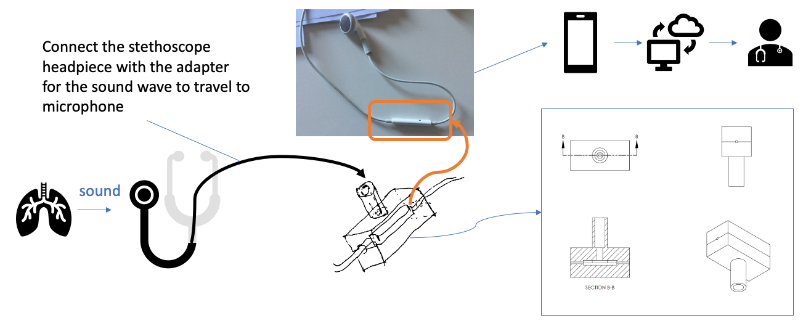

# Breathe Easier Adapter Design

COVID-19 is spreading quickly, we cannot wait for manufacture capability to ramp up. This design uses only components most household already have or can easily obtain, so that everyone can make one for themselves or get one from friends and family.

1. Because smartphone has many different designs, it will be difficult to make an one-size-fits-all adapter for the microphone on the smartphone. But most people can easily get an earplug with microphone. We started the first design to fit the microphone on the <a href="https://en.wikipedia.org/wiki/File:IPod_Touch_2G_Remote_Mic.jpg" target="_blank">Apple Earphones with Remote and Mic</a> (introduced in 2009 and were bundled with the iPhone 3GS, iPhone 4, iPhone 4S, the third-generation iPod touch, and sold independently). Because its microphone's diaphragm is directly connected to air through a hole, so that very weak sound waves can travel to the microphone's diaphragm. (The newer version of <a href="https://en.wikipedia.org/wiki/File:EarPods_derecho.JPG" target="_blank">Apple Earpods</a> has a complete plastic cover over the microphone, which makes it difficult to pickup the sound coming from Stethoscope.)

2. The adapter design is shown in the following diagram:

The adapter connects to a stethoscope headpiece with a tube. The sound travels from the headpiece to the earphone's microphone, then converted to electronic signal. The smartphone can record the sound as file and send it to the doctor, or stream the sound to the doctor via telemedicine platform's app.

3. To connect the headpiece with the adapter. The user can either cut the stethoscope's orginal tube, or they can take the headpiece off and connect with a silicone tube which can easily buy. [Amazon](https://www.amazon.com/gp/product/B01N8QHD6L/)